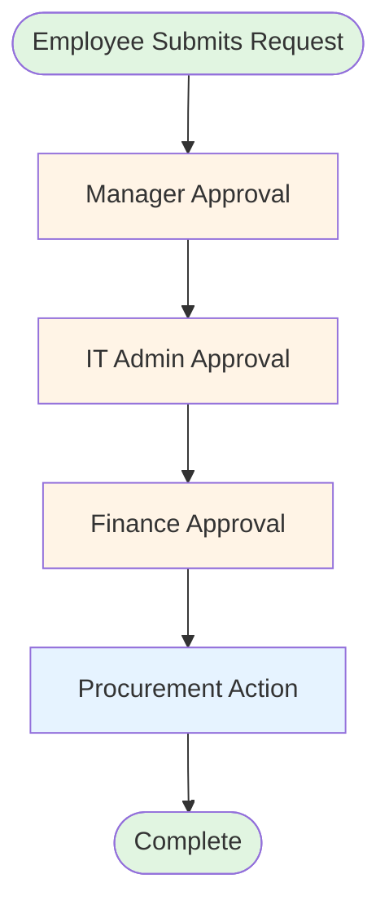
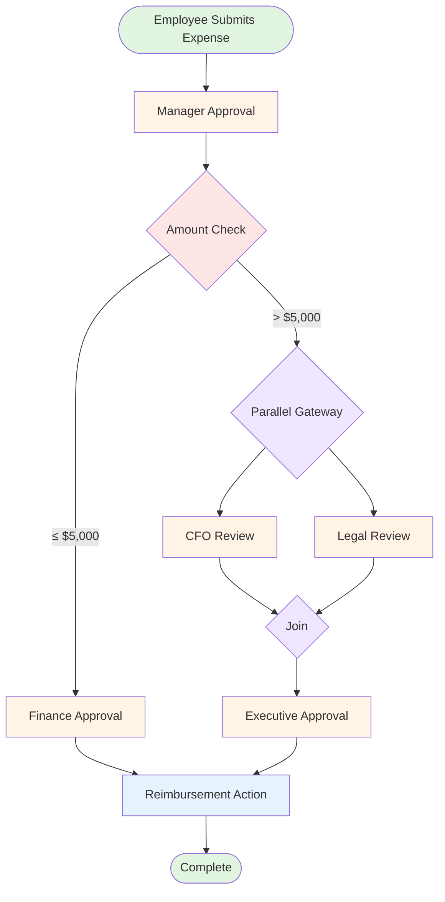
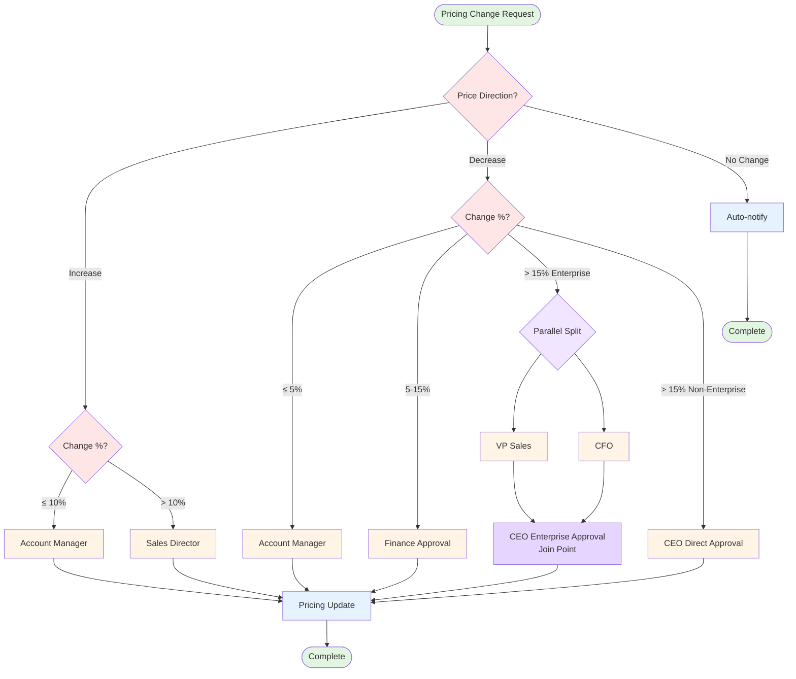

# Workflow Examples

This document provides examples of simple and complex workflows for the Relay-OS platform, demonstrating various capabilities including linear approvals, conditional routing, parallel processing, and join logic.

---

## 1. Simple Workflow: Equipment Purchase Request

**Use Case**: Employee requests new equipment, requires multi-level approval and procurement action.

**Characteristics**:
- Linear flow (no conditionals)
- Multiple sequential approvals
- Single execution action

### Workflow Definition (JSON)

```json
{
  "name": "Equipment Purchase Request",
  "start_key": "manager_approval",
  "fields": [
    {
      "key": "employee_name",
      "label": "Employee Name",
      "type": "short_text",
      "required": true,
      "position": 0
    },
    {
      "key": "equipment_type",
      "label": "Equipment Type",
      "type": "select",
      "options": ["Laptop", "Monitor", "Keyboard", "Mouse", "Headset", "Other"],
      "required": true,
      "position": 1
    },
    {
      "key": "estimated_cost",
      "label": "Estimated Cost",
      "type": "currency",
      "required": true,
      "position": 2
    },
    {
      "key": "justification",
      "label": "Justification",
      "type": "long_text",
      "description": "Why is this equipment needed?",
      "required": true,
      "position": 3
    },
    {
      "key": "preferred_vendor",
      "label": "Preferred Vendor",
      "type": "short_text",
      "position": 4
    }
  ],
  "steps": [
    {
      "key": "manager_approval",
      "type": "approval",
      "assignees": ["manager@company.com"],
      "next": "it_approval"
    },
    {
      "key": "it_approval",
      "type": "approval",
      "assignees": ["it-admin@company.com"],
      "next": "finance_approval"
    },
    {
      "key": "finance_approval",
      "type": "approval",
      "assignees": ["finance@company.com"],
      "next": "procurement_action"
    },
    {
      "key": "procurement_action",
      "type": "action",
      "assignee": "procurement@company.com"
    }
  ]
}
```

### Workflow Diagram



### Flow Description

1. **Manager Approval** - Direct manager reviews business need and approves/rejects
2. **IT Approval** - IT Admin verifies technical specifications and compatibility
3. **Finance Approval** - Finance team approves budget allocation
4. **Procurement Action** - Procurement team executes the purchase order

**Complexity**: ⭐ (Simple - Linear flow)

---

## 2. Complex Workflow: High-Value Expense Approval with Parallel Reviews

**Use Case**: Expense submission with parallel approvals for high-value items requiring both financial and legal review before executive sign-off.

**Characteristics**:
- Conditional routing based on amount
- Parallel approval paths
- Join logic (multiple approvals converge)
- Multiple approval levels

### Workflow Definition (JSON)

```json
{
  "name": "High-Value Expense Approval",
  "start_key": "manager_approval",
  "fields": [
    {
      "key": "employee_name",
      "label": "Employee Name",
      "type": "short_text",
      "required": true,
      "position": 0
    },
    {
      "key": "expense_category",
      "label": "Expense Category",
      "type": "select",
      "options": ["Travel", "Equipment", "Software", "Consulting", "Marketing", "Training"],
      "required": true,
      "position": 1
    },
    {
      "key": "amount",
      "label": "Amount",
      "type": "currency",
      "required": true,
      "position": 2
    },
    {
      "key": "description",
      "label": "Description",
      "type": "long_text",
      "required": true,
      "position": 3
    },
    {
      "key": "business_justification",
      "label": "Business Justification",
      "type": "long_text",
      "required": true,
      "position": 4
    }
  ],
  "steps": [
    {
      "key": "manager_approval",
      "type": "approval",
      "assignees": ["manager@company.com"],
      "next": "amount_check"
    },
    {
      "key": "amount_check",
      "type": "gateway:exclusive",
      "branches": [
        {
          "condition": "amount <= 5000",
          "to": "finance_approval"
        },
        {
          "condition": "amount > 5000",
          "to": "parallel_review"
        }
      ]
    },
    {
      "key": "finance_approval",
      "type": "approval",
      "assignees": ["finance@company.com"],
      "next": "reimbursement"
    },
    {
      "key": "parallel_review",
      "type": "gateway:parallel",
      "branches": [
        {
          "to": "finance_review"
        },
        {
          "to": "legal_review"
        }
      ]
    },
    {
      "key": "finance_review",
      "type": "approval",
      "assignees": ["cfo@company.com"]
    },
    {
      "key": "legal_review",
      "type": "approval",
      "assignees": ["legal@company.com"]
    },
    {
      "key": "executive_approval",
      "type": "approval",
      "assignees": ["ceo@company.com"],
      "join": ["finance_review", "legal_review"],
      "next": "reimbursement"
    },
    {
      "key": "reimbursement",
      "type": "action",
      "assignee": "payroll@company.com"
    }
  ]
}
```

### Workflow Diagram



### Flow Description

1. **Manager Approval** - Direct manager reviews and approves
2. **Amount Check Gateway** - Routes based on expense amount:
   - **≤ $5,000**: Goes to standard Finance approval
   - **> $5,000**: Enters parallel review process
3. **Parallel Review** (for amounts > $5,000):
   - **CFO Review** - Financial analysis and budget impact
   - **Legal Review** - Contract and compliance review
   - *Both reviews happen simultaneously*
4. **Join Point** - Waits for BOTH CFO and Legal reviews to complete
5. **Executive Approval** - CEO provides final approval after parallel reviews
6. **Reimbursement** - Payroll processes the payment

### Key Features Demonstrated

✅ **Exclusive Gateway** - Routes to one path based on condition  
✅ **Parallel Gateway** - Splits into multiple simultaneous paths  
✅ **Join Logic** - `executive_approval` has `join: ["finance_review", "legal_review"]`  
✅ **Conditional Routing** - Different approval chains based on amount  

**Complexity**: ⭐⭐⭐⭐ (Complex - Parallel processing with join)

---

## 3. Very Complex Workflow: Pricing Change with Multiple Conditionals

**Use Case**: Merchant pricing changes with dynamic routing based on price change percentage, direction (increase/decrease), and merchant tier.

**Characteristics**:
- Multiple nested gateways
- Complex CEL expressions with calculations
- Multi-field conditional logic
- Parallel approvals for enterprise customers

### Workflow Definition (JSON)

```json
{
  "name": "Pricing Change Request",
  "start_key": "routing_decision",
  "fields": [
    {
      "key": "merchant_name",
      "label": "Merchant Name",
      "type": "short_text",
      "required": true,
      "position": 0
    },
    {
      "key": "current_price",
      "label": "Current Price",
      "type": "currency",
      "required": true,
      "position": 1
    },
    {
      "key": "proposed_price",
      "label": "Proposed Price",
      "type": "currency",
      "required": true,
      "position": 2
    },
    {
      "key": "merchant_tier",
      "label": "Merchant Tier",
      "type": "select",
      "options": ["Bronze", "Silver", "Gold", "Platinum", "Enterprise"],
      "required": true,
      "position": 3
    },
    {
      "key": "change_reason",
      "label": "Reason for Change",
      "type": "select",
      "options": ["Volume Discount", "Competitive Match", "Contract Renewal", "Service Issue", "Strategic Partnership"],
      "required": true,
      "position": 4
    },
    {
      "key": "justification",
      "label": "Detailed Justification",
      "type": "long_text",
      "required": true,
      "position": 5
    }
  ],
  "steps": [
    {
      "key": "routing_decision",
      "type": "gateway:exclusive",
      "branches": [
        {
          "condition": "proposed_price > current_price",
          "to": "price_increase_check"
        },
        {
          "condition": "proposed_price < current_price",
          "to": "price_decrease_check"
        },
        {
          "condition": "proposed_price == current_price",
          "to": "no_change_notification"
        }
      ]
    },
    {
      "key": "price_increase_check",
      "type": "gateway:exclusive",
      "branches": [
        {
          "condition": "(proposed_price - current_price) / current_price <= 0.1",
          "to": "account_manager_approval"
        },
        {
          "condition": "(proposed_price - current_price) / current_price > 0.1",
          "to": "sales_director_approval"
        }
      ]
    },
    {
      "key": "price_decrease_check",
      "type": "gateway:exclusive",
      "branches": [
        {
          "condition": "(current_price - proposed_price) / current_price <= 0.05",
          "to": "account_manager_approval"
        },
        {
          "condition": "(current_price - proposed_price) / current_price > 0.05 && (current_price - proposed_price) / current_price <= 0.15",
          "to": "finance_approval"
        },
        {
          "condition": "(current_price - proposed_price) / current_price > 0.15 && merchant_tier == 'Enterprise'",
          "to": "enterprise_discount_approval"
        },
        {
          "condition": "(current_price - proposed_price) / current_price > 0.15 && merchant_tier != 'Enterprise'",
          "to": "ceo_direct_approval"
        }
      ]
    },
    {
      "key": "account_manager_approval",
      "type": "approval",
      "assignees": ["account-manager@company.com"],
      "next": "pricing_update"
    },
    {
      "key": "sales_director_approval",
      "type": "approval",
      "assignees": ["sales-director@company.com"],
      "next": "pricing_update"
    },
    {
      "key": "finance_approval",
      "type": "approval",
      "assignees": ["finance@company.com"],
      "next": "pricing_update"
    },
    {
      "key": "enterprise_discount_approval",
      "type": "gateway:parallel",
      "branches": [
        {
          "to": "vp_sales_approval"
        },
        {
          "to": "cfo_approval"
        }
      ]
    },
    {
      "key": "vp_sales_approval",
      "type": "approval",
      "assignees": ["vp-sales@company.com"]
    },
    {
      "key": "cfo_approval",
      "type": "approval",
      "assignees": ["cfo@company.com"]
    },
    {
      "key": "ceo_direct_approval",
      "type": "approval",
      "assignees": ["ceo@company.com"],
      "next": "pricing_update"
    },
    {
      "key": "ceo_enterprise_approval",
      "type": "approval",
      "assignees": ["ceo@company.com"],
      "join": ["vp_sales_approval", "cfo_approval"],
      "next": "pricing_update"
    },
    {
      "key": "pricing_update",
      "type": "action",
      "assignee": "pricing-ops@company.com"
    },
    {
      "key": "no_change_notification",
      "type": "system_task",
      "action": {
        "type": "auto_approve"
      }
    }
  ]
}
```

### Workflow Diagram



### Flow Description

1. **Routing Decision** - Determines if price is increasing, decreasing, or unchanged
2. **Price Increase Path**:
   - ≤10% increase → Account Manager approval
   - \>10% increase → Sales Director approval
3. **Price Decrease Path**:
   - ≤5% decrease → Account Manager approval
   - 5-15% decrease → Finance approval
   - \>15% decrease (Enterprise) → Parallel: VP Sales + CFO → CEO Enterprise Approval (join point)
   - \>15% decrease (Non-Enterprise) → CEO Direct Approval
4. **Join Logic** - For Enterprise >15% discounts, `ceo_enterprise_approval` waits for BOTH `vp_sales_approval` AND `cfo_approval` to complete
5. **Pricing Update** - Operations team executes the change

**Key Difference**: Two separate CEO approval steps prevent the workflow from hanging:
- `ceo_direct_approval` - No join, for non-Enterprise customers
- `ceo_enterprise_approval` - Has join logic, waits for parallel approvals

### Conditional Logic Examples

**Calculate Price Increase Percentage:**
```cel
(proposed_price - current_price) / current_price <= 0.1
```

**Calculate Price Decrease with Tier Check:**
```cel
# Enterprise path (parallel approvals)
(current_price - proposed_price) / current_price > 0.15 && merchant_tier == 'Enterprise'

# Non-Enterprise path (direct CEO)
(current_price - proposed_price) / current_price > 0.15 && merchant_tier != 'Enterprise'
```

### Key Features Demonstrated

✅ **Nested Gateways** - Gateway leading to another gateway  
✅ **Complex CEL Expressions** - Percentage calculations in conditions  
✅ **Multi-field Conditionals** - Logic based on multiple field values  
✅ **Parallel Approvals with Join** - Enterprise path has VP Sales + CFO → CEO  
✅ **Context-aware Routing** - Different paths based on merchant tier  

**Complexity**: ⭐⭐⭐⭐⭐ (Very Complex)

---

## Comparison Table

| Feature | Equipment Purchase | High-Value Expense | Pricing Change |
|---------|-------------------|-------------------|----------------|
| **Flow Type** | Linear | Conditional + Parallel | Nested Conditional + Parallel |
| **Gateways** | 0 | 2 (exclusive + parallel) | 4 (3 exclusive + 1 parallel) |
| **Join Logic** | ❌ | ✅ (finance + legal) | ✅ (VP Sales + CFO) |
| **Parallel Approvals** | ❌ | ✅ | ✅ |
| **Nested Conditions** | ❌ | ❌ | ✅ |
| **Total Steps** | 4 | 8 | 13 |
| **Max Approval Depth** | 3 | 4 | 4 |
| **Complexity** | ⭐ | ⭐⭐⭐⭐ | ⭐⭐⭐⭐⭐ |

---

## Understanding Join Logic

**What is a Join?**
A join waits for multiple parallel paths to complete before proceeding to the next step.

**Example from High-Value Expense:**
```json
{
  "key": "executive_approval",
  "type": "approval",
  "join": ["finance_review", "legal_review"],
  "assignees": ["ceo@company.com"]
}
```

This means:
- `executive_approval` will NOT activate until BOTH `finance_review` AND `legal_review` are completed
- The workflow engine tracks which steps are complete
- Only when all steps in the `join` array are done does `executive_approval` become active

**Visual Representation:**
```
Parallel Split
    ├─ Path A ─┐
    │          ├─ Join → Next Step
    └─ Path B ─┘
```

Both Path A and Path B must complete before the Join allows progression.

---

## Mermaid Diagram Legend

- 🟢 **Green Rounded** - Start/End points
- 🟡 **Yellow Rectangle** - Approval steps (human decision)
- 🔴 **Red Diamond** - Exclusive Gateway (choose one path)
- 🟣 **Purple Diamond** - Parallel Gateway/Join (split or merge paths)
- 🔵 **Blue Rectangle** - Action steps (execution/system task)

---

## Best Practices

### For Simple Workflows
1. Keep steps sequential and clear
2. Use descriptive step names
3. Minimize approval levels (3-4 maximum)
4. Ensure each approver adds distinct value

### For Complex Workflows
1. **Test all branches** - Verify every conditional path works
2. **Use parallel wisely** - Only when approvals are truly independent
3. **Plan join points** - Ensure all parallel paths eventually converge
4. **Document conditions** - Add comments for complex CEL expressions
5. **Consider edge cases** - Test boundary values (exactly $5000, $10000, etc.)
6. **Monitor performance** - Track where requests get stuck

### Common Pitfalls to Avoid
- ❌ Too many approval levels (slows process)
- ❌ Missing fallback conditions (workflow gets stuck)
- ❌ Circular dependencies in joins
- ❌ Overly complex conditions (hard to test and debug)
- ❌ Parallel paths that don't need to be parallel

---

## Next Steps

1. **Copy JSON** - Use the JSON definitions above in your API calls
2. **Test with API**: 
   ```bash
   POST /workspaces/{workspaceId}/workflows
   ```
3. **Publish Workflow**:
   ```bash
   POST /workflows/{workflowId}/publish
   ```
4. **Create Test Requests** - Try different field values to exercise all paths
5. **Monitor & Iterate** - Adjust based on real-world usage

See the complete JSON definitions ready for API use! 🚀
